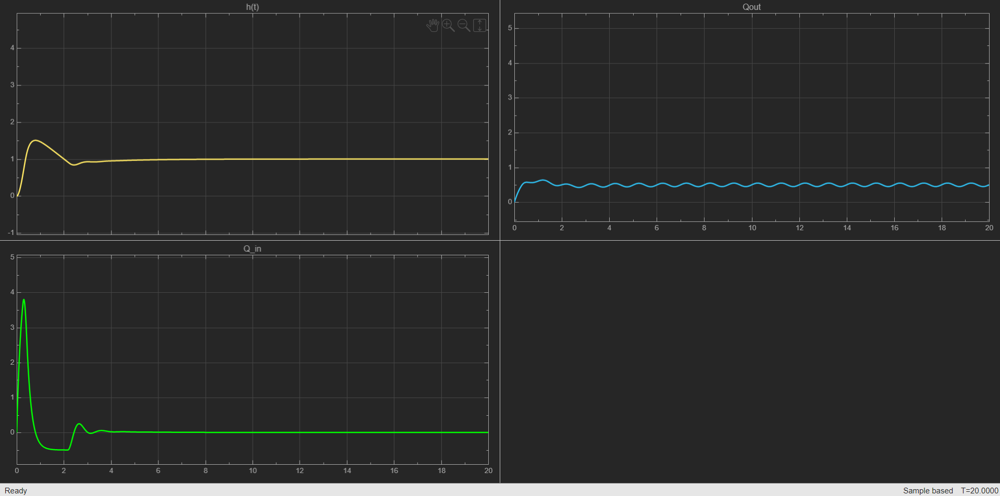

# tank-level-pid-control
PID control simulation of a nonlinear water tank system with disturbance rejection in Simulink.

## Project Overview
This project presents the design and simulation of a PID controller used to regulate the liquid level in a tank system. The simulation is built in MATLAB/Simulink and accounts for realistic physical constraints, including nonlinear discharge dynamics and external disturbances.  
The goal is to maintain a specific reference level \($h_{ref}$\) despite varying outflow conditions and actuator limitations.

## Mathematical Model
The system is modeled based on Torricelli's Law:

$$Q_{out} = k \cdot \sqrt{h} + d(t)$$

Where:  
- h: Liquid level (m)  
- k: Discharge coefficient  
- d(t): Time-varying disturbance (sine wave to simulate ripples)

## Control Strategy
A Parallel PID Controller was implemented with:  
- **Actuator Saturation**: Limits Q_{in} to pump capacity  
- **Anti-Windup**: Prevents integral buildup during saturation  
- **Disturbance Rejection**: Suppresses effects of d(t) 

## Simulation Results
- **Fast Rise Time**: Target level reached <1s  
- **Zero Steady-State Error**: Integral eliminates offset  
- **Robustness**: 1Hz sinusoidal disturbance attenuated  

## How to Use
2. Open `TankLevelControl.slx` in MATLAB.
3. Click 'Run' and open the 'Scope' block to see the results.
